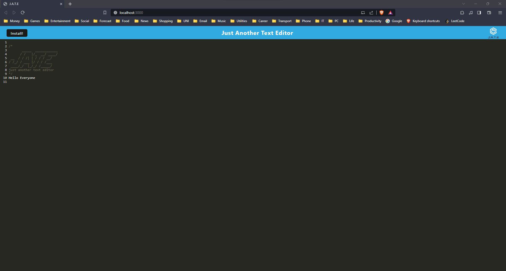
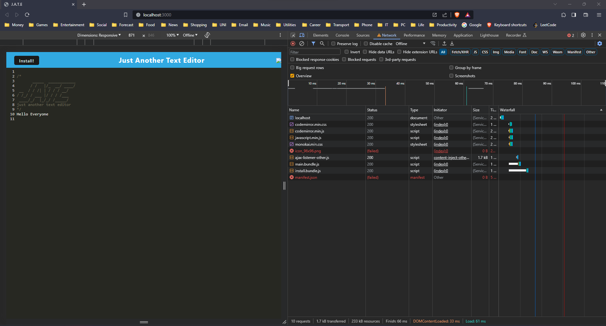

# Just another text editor
Progressive Web Applications: Text Editor    


    
## 📄 Description 
This text editor is a single-page application that runs in the browser and meets the PWA criteria. It also features a number of data persistence techniques that serve as redundancy in case one of the options is not supported by the browser. The application also functions offline.  

To build this text editor, methods for getting and storing data to an IndexedDB database were implemented using the idb package. IndexedDB is a NoSQL database that is built into the browser and allows for offline data storage. idb is a lightweight wrapper around the IndexedDB API that makes it easier to use.  

The text editor can be installed as a PWA, which means that it can be added to your home screen and launched like a native app. It is also offline compatible, so you can continue to work on your documents even when you don't have an internet connection.  

## 🪛 Technologies used 
<p><a href="https://nodejs.org/">Node.js</a></p>
<p><a href="https://www.npmjs.com/">NPM</a></p>
<p><a href="https://www.npmjs.com/package/express">Express.js</a></p>
<p><a href="https://www.npmjs.com/package/dotenv">dotenv</a></p>
<p><a href="https://www.npmjs.com/package/if-env">if-env</a></p>
<p><a href="https://www.npmjs.com/package/concurrently">concurrently</a></p>
<p><a href="https://www.npmjs.com/package/nodemon">nodemon</a></p>
<p><a href="https://www.npmjs.com/package/code-mirror-themes">code-mirror-themes</a></p>
<p><a href="https://www.npmjs.com/package/idb">idb</a></p>
<p><a href="https://www.npmjs.com/package/@babel/core">@babel/core</a></p>
<p><a href="https://www.npmjs.com/package/@babel/plugin-proposal-object-rest-spread">@babel/plugin-proposal-object-rest-spread</a></p>
<p><a href="https://www.npmjs.com/package/@babel/plugin-transform-runtime">@babel/plugin-transform-runtime</a></p>
<p><a href="https://www.npmjs.com/package/@babel/preset-env">@babel/preset-env</a></p>
<p><a href="https://www.npmjs.com/package/@babel/runtime">@babel/runtime</a></p>
<p><a href="https://www.npmjs.com/package/babel-loader">babel-loader</a></p>
<p><a href="https://www.npmjs.com/package/css-loader">css-loader</a></p>
<p><a href="https://www.npmjs.com/package/html-webpack-plugin">html-webpack-plugin</a></p>
<p><a href="https://www.npmjs.com/package/http-server">http-server</a></p>
<p><a href="https://www.npmjs.com/package/style-loader">style-loader</a></p>
<p><a href="https://www.npmjs.com/package/webpack">webpack</a></p>
<p><a href="https://www.npmjs.com/package/webpack-cli">webpack-cli</a></p>
<p><a href="https://www.npmjs.com/package/webpack-dev-server">webpack-dev-server</a></p>
<p><a href="https://www.npmjs.com/package/webpack-pwa-manifest">webpack-pwa-manifest</a></p>
<p><a href="https://www.npmjs.com/package/workbox-webpack-plugin">workbox-webpack-plugin</a></p>
<p><a href="https://www.heroku.com/">Heroku</a></p>
  
## 📓 Table of Contents
- [Installation](#%EF%B8%8FInstallation)
- [Usage](#Usage)
- [Screenshot](#%EF%B8%8FScreenshot)
- [Video](#Video)
- [License](#%EF%B8%8FLicense)
- [Contributing](#Contributing)
- [Tests](#%EF%B8%8FTests)
- [Questions](#Questions)
    
## 🖥️Installation 

Users can clone the code and run npm install to install the dependencies
```pip
 npm install 
```

Otherwise this app requires the following installations.

Express.js
```pip
 npm install express
```

idb
```pip
  npm i idb
```

if-env
```pip
  npm install if-env --save
```

Concurrently
```pip
  npm install concurrently --save
```

Babel loader
```pip
  npm install -D babel-loader @babel/core @babel/preset-env webpack
```

css-loader
```pip
  npm install --save-dev css-loader
```

style-loader
```pip
  npm install --save-dev style-loader
```

html-webpack-plugin
```pip
  npm i --save-dev html-webpack-plugin
```

http-server
```pip
  npm install http-server
```

Webpack
```pip
  npm install --save-dev webpack
```

webpack-CLI
```pip
 npm install --save-dev webpack-cli
``` 

webpack-dev-server
```pip
  npm install webpack-dev-server --save-dev
```

webpack-pwa-manifest

```pip
  npm install --save-dev webpack-pwa-manifest
```

workbox-webpack-plugin

```pip
  npm i workbox-webpack-plugin
```
  
## 💬Usage 
Users can utilise this web application to take notes that runs in the browser. Additionally, it will feature a number of data persistence techniques that serve as redundancy in case one of the options is not supported by the browser. The application will also function offline.

Link to deployed application


## 🖼️Screenshot
Screenshot of JATE Text Editor


Screenshot of JATE Text Editor Offline


## 📹Video
GIF Showing app manifest.json, service worker, indexedDB storage, installation, Network tab


  
## ⚖️License 
This project is licensed under MIT
  
## 🤝Contributing 
Brian Trang  
With thanks to USYD
  
## 🛠️Tests
N/A
 
## ❔Questions
If you have any questions about this project, please contact me directly at brian.trang9@gmail.com. Feel free to view more of my projects at https://github.com/MakeRedundant.